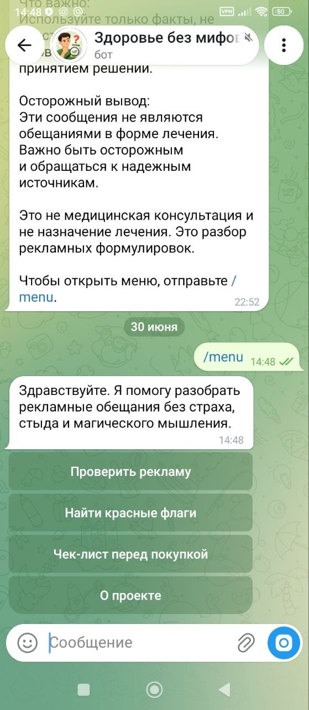
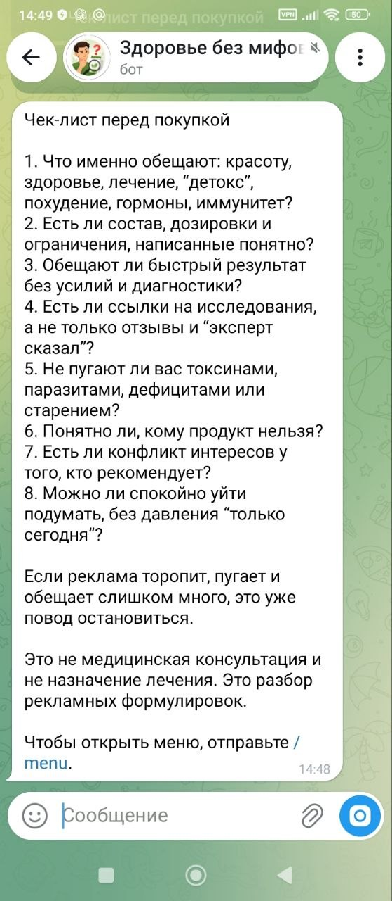
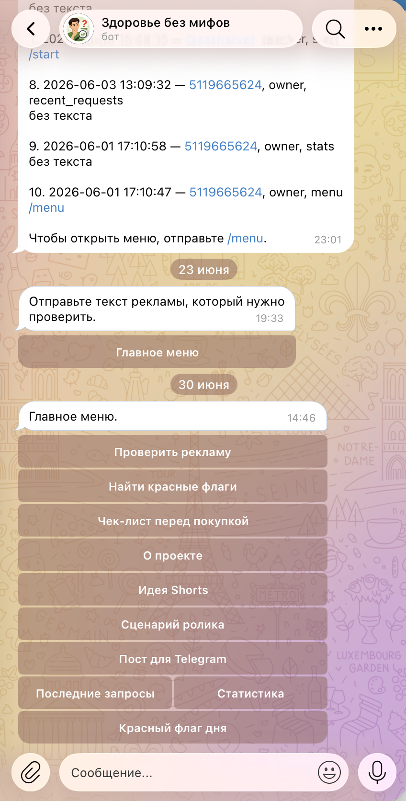
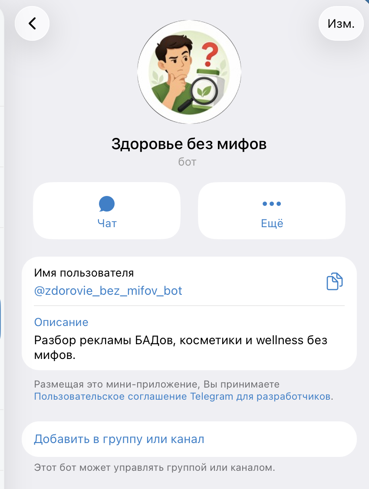

# Telegram-бот для информационного проекта

Telegram-бот для структурирования и выдачи информации пользователям через удобное меню. В проекте реализованы пользовательский и административный режимы, чтобы обычный пользователь мог получать материалы, а администратор — управлять содержимым проекта.

## Задача проекта

Проект создан для того, чтобы упростить доступ пользователей к информации. Вместо ручной отправки материалов бот помогает разложить материалы по разделам, показывает нужную информацию через меню и делает взаимодействие с проектом более удобным.

## Что умеет бот

- Показывает главное меню пользователя
- Даёт доступ к разделам с информацией
- Помогает структурировать материалы проекта
- Работает с пользовательскими сценариями
- Поддерживает административный режим
- Позволяет управлять содержимым проекта
- Упрощает навигацию по материалам
- Помогает автоматизировать выдачу информации

## Режимы работы

В боте реализованы два режима работы: пользовательский — для получения и навигации по материалам, и административный — для управления содержимым проекта.

### Пользовательский режим

Пользователь запускает бота, выбирает нужный раздел в меню и получает информацию в понятном формате.

### Административный режим

Администратор может управлять материалами, добавлять или редактировать информацию, проверять структуру разделов и поддерживать актуальность содержимого.

## Скриншоты

### Пользовательский режим

<table>
  <tr>
    <td align="center"><b>Главное меню</b></td>
    <td align="center"><b>Пример информационного раздела</b></td>
  </tr>
  <tr>
    <td align="center"></td>
<td align="center"></td>
  </tr>
</table>

### Административный интерфейс и профиль бота

<table>
  <tr>
    <td align="center"><b>Административный режим</b></td>
    <td align="center"><b>Профиль бота</b></td>
  </tr>
  <tr>
    <td align="center"></td>
    <td align="center"></td>
  </tr>
</table>

## Использованные технологии

- Telegram Bot API
- Пользовательские сценарии
- Административные команды
- Работа с данными
- JSON / структура данных
- Git / GitHub
- VS Code

## Моя роль в проекте

Я проектировала и дорабатывала логику Telegram-бота с использованием ChatGPT / Codex как инструментов разработки.

В рамках проекта я:
- продумывала структуру бота и пользовательское меню;
- проектировала пользовательский и административный режимы;
- настраивала логику работы с материалами и разделами;
- продумывала административные команды и сценарии управления контентом;
- работала со структурой данных;
- тестировала пользовательские сценарии и поведение бота;
- дорабатывала логику по результатам проверки.

## Статус проекта

Рабочий Telegram-бот с пользовательским и административным режимами.

Проект реализован и протестирован как прикладной инструмент для структурированной выдачи информации и управления содержимым через Telegram.
